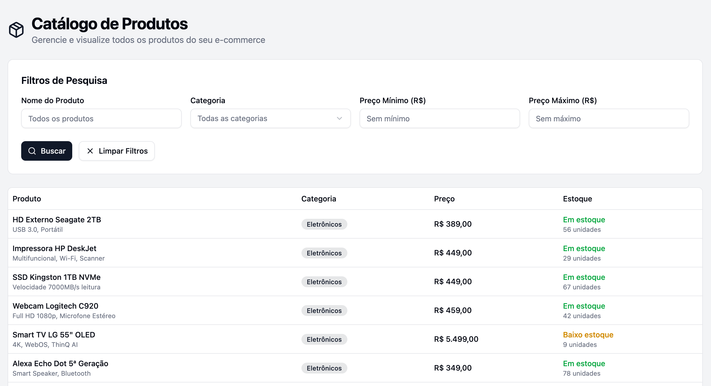
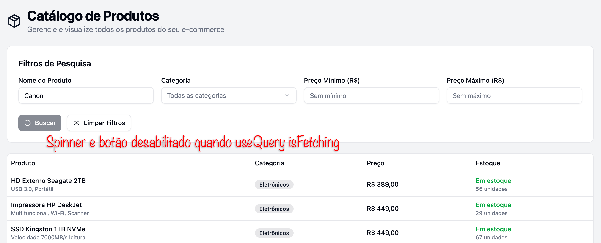

# Aplicação React com backend em Go com filtros e paginação na API

A aplicação possui um formulário "React Hook Form" com validação "Zod" para preenchimento dos filtros.

Quando o usuário faz a busca, o botão é desabilitado e um spinner entra em execução no lugar da lupa.

As informações são trocadas entre os componentes via store "Zustand".

O cache do resultado é gerenciado pela biblioteca "Tanstack Query" que acessa a API via "axios".

O backend está escrito em Go e tem um delay para simulação da demora da API...
